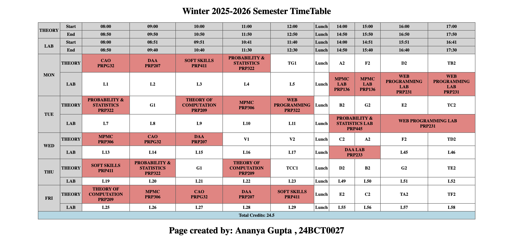

# HTML Semester Timetable

This project demonstrates how to create structured tables using HTML.

## Features
- Timetable layout using HTML tables
- Use of rowspan and colspan
- Table caption and alignment
- Alternate row colors for readability

## Technologies Used
HTML

## Concepts Practiced
- Table structure
- Cell merging
- Table styling using attributes

## Live Demo 
Live Demo: https://ananyagpt1105.github.io/html-semester-timetable/

## Preview

